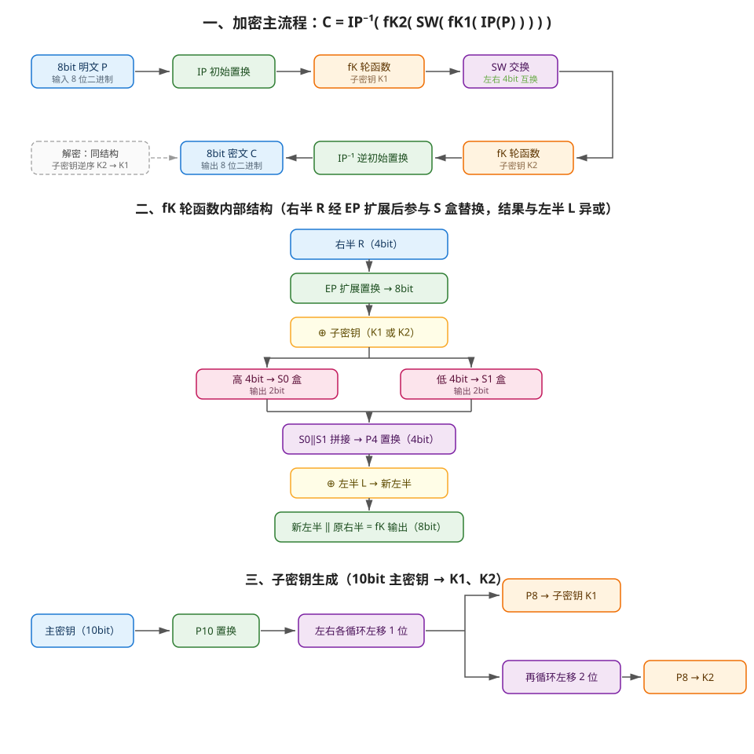
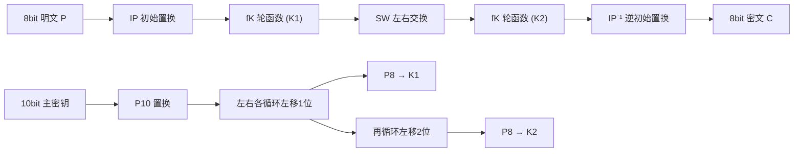

# S-DES（简化 DES）加解密系统 —— C++ 实现

课程大作业：使用 C++ 实现 S-DES（Simplified DES）算法，覆盖作业文档要求的**全部五关**与**扩展要求**。

**仓库地址（Gitee）：https://gitee.com/yewandeyu/yewandeyu**

## 一、功能总览

| 关卡 / 要求 | 功能 | 对应程序 |
|---|---|---|
| 第1关 基本要求 | 8bit 明文 + 10bit 密钥 → 8bit 密文，支持加密与解密，GUI 交互 | `SdesGui.exe` / 控制台 [1] |
| 第2关 交叉测试 | 小组统一明密文样本表，验证各成员算法流程与转换单元一致 | 控制台 [2] |
| 第3关 扩展功能 | ASCII / 中文（UTF-8）字符串按 1 Byte 分组加解密；TCP Socket 传输密文 | 控制台 [3][6] / GUI / `SdesServer.exe` + `SdesClient.exe` |
| 第4关 暴力破解 | 多线程并行遍历 1024 个密钥，带时间戳与耗时统计，列出所有满足的密钥 | 控制台 [4] / GUI |
| 第5关 封闭性分析 | 给定明密文对，输出所有能建立该映射的密钥并统计数量；附全量扫描直方图 | 控制台 [5][7] / GUI |

> 算法约定：所有置换表（P10 / P8 / IP / IP⁻¹ / EP / P4）与 S0、S1 盒集中在 `src/SDES.h` 顶部常量区，小组交叉测试只需核对这一处。若与课程 PPT 有出入，仅改常量表即可。

## 二、目录结构

```text
SDES/
├── src/
│   ├── SDES.h            核心算法头文件（含全部置换表 / S 盒常量与接口注释）
│   ├── SDES.cpp          核心算法实现（置换、轮函数 fK、子密钥生成、加解密、暴力破解）
│   ├── Main.cpp          控制台程序（第1~5关 + 字符串加解密 + 全量封闭性扫描）
│   ├── SdesGui.cpp       Win32 图形界面程序（第1关、字符串、第4/5关）
│   ├── TcpServerMain.cpp TCP 服务端（接收密文并解密回显）
│   └── TcpClientMain.cpp TCP 客户端（加密明文并发送）
├── tools/
│   ├── sdes_reference.py 独立 Python 参考实现（用于交叉验证 C++ 实现正确性）
│   ├── gen_media.py      报告媒体生成脚本（将真实运行输出渲染为截图与动图）
│   ├── capture_gui.py    GUI 驱动与窗口截图脚本（Win32 API）
│   └── gen_docx.py       Word 版测试结果文档生成脚本
├── docs/
│   ├── 测试结果.docx     ★ Word 版测试结果文档（文字 + 关键代码 + 表格 + 截图）
│   ├── 测试报告.md       按 5 个关卡组织的测试结果（文字 + 表格 + 截图 + 动图）
│   ├── 用户指南.md       编译、启动、各程序使用方法与常见问题
│   ├── 开发手册.md       架构设计、核心库接口文档、实现约定、扩展指南
│   ├── flowchart.svg     程序流程图
│   ├── 暴力破解动图.gif  第4关暴力破解全过程（带时间戳计时）
│   └── screenshots/      各关卡运行截图
└── README.md
```

## 三、编译方法（g++ / MinGW）

```bash
# 1. 控制台程序（第1~5关 + 字符串）
g++ -std=c++17 -O2 -o SdesConsole.exe src/SDES.cpp src/Main.cpp -pthread

# 2. 图形界面程序（Win32 API，无第三方依赖）
g++ -std=c++17 -O2 -municode -mwindows -o SdesGui.exe src/SdesGui.cpp src/SDES.cpp

# 3. TCP 服务端 / 客户端
g++ -std=c++17 -O2 -o SdesServer.exe src/TcpServerMain.cpp src/SDES.cpp -lws2_32
g++ -std=c++17 -O2 -o SdesClient.exe src/TcpClientMain.cpp src/SDES.cpp -lws2_32
```

Windows 下也可用 MinGW / MSYS2 的 g++ 直接编译；GUI 与 TCP 部分依赖 Win32 API，仅支持 Windows。

## 四、程序流程图



Mermaid 版本（GitHub / Gitee 可直接渲染）：



解密与加密结构完全相同，仅子密钥使用顺序颠倒（先 K2 后 K1）。

## 五、使用说明

### 控制台程序（SdesConsole.exe）

```text
[1] 第1关：8bit 明文加解密          输入 8bit 明文与 10bit 密钥，输出密文并演示解密回环
[2] 第2关：交叉测试                 运行内置统一样本表，逐条验证加密与解密回环
[3] 第3关：字符串加密               支持 ASCII / 中文，输出十六进制密文
[4] 第4关：暴力破解                 多线程遍历 1024 密钥，带时间戳与耗时统计
[5] 第5关：封闭性分析               输入明密文对，输出所有满足密钥及数量
[6] 字符串解密                      输入十六进制密文还原明文
[7] 全量封闭性扫描                  统计 65536 个明密文对的密钥满足分布（报告数据）
```

### 图形界面（SdesGui.exe）

窗口分三个分组：**8bit 数据加解密**（第1关）、**字符串加解密**（第3关）、**暴力破解 / 封闭性分析**（第4、5关），均为按钮交互。

### TCP 传输（第3关扩展）

先启动服务端（监听 127.0.0.1:8888），再运行客户端，输入密钥与明文，客户端加密后经 TCP 发送，服务端解密回显：

```bash
SdesServer.exe          # 先启动
SdesClient.exe          # 另开一个终端启动
```

## 六、代码规范落实（对应文档第 4 节）

- **4.1 命名规范**：类、函数、全局常量统一帕斯卡命名法（大驼峰），如 `EncryptBit8`、`GenerateSubKeys`、`CrossTestSamples`；变量见名知意，如 `PlainValue`、`CipherBits`、`FoundKeys`。
- **4.2 注释说明**：头文件以"文件头注释 + 接口注释"说明每个函数的用途、参数与返回值；实现中每个算法步骤均有行内注释（如"P10 置换""S 盒行号 = 输入的 b0b3"）。
- **4.3 消灭繁复逻辑**：置换操作抽象为通用函数 `Permute(Value, Table, TableLen, InputWidth)`，所有 P 盒复用同一实现；加解密共用 `FunctionFk` / `SwitchSW`；暴力破解与封闭性分析复用同一遍历逻辑 `BruteForceKeys`。

## 七、提交要求对照（对应文档第 5 节）

- [x] 仓库链接：[https://gitee.com/yewandeyu/yewandeyu](https://gitee.com/yewandeyu/yewandeyu)
- [x] 5.2.1 README（本文档）
- [x] 程序流程图（`docs/flowchart.svg`，README 内附 Mermaid 版）
- [x] 5.2.2 测试结果：
  - **`docs/测试结果.docx`（Word 版，主交付）** —— 文字说明 + 题目关键代码 + 结果表格 + 运行截图（含 GUI 截图）
  - `docs/测试报告.md` —— Markdown 版，按 5 个关卡给出文字、表格、**运行截图**（`docs/screenshots/`）与**暴力破解动图**（`docs/暴力破解动图.gif`，带时间戳计时）
- [x] 5.2.3 相关文档：`docs/用户指南.md`（安装、使用、常见问题）、`docs/开发手册.md`（架构、核心库接口文档、实现约定、扩展指南）
- [x] 源码（含中文注释、符合命名规范）

