# S-DES 加解密系统 —— 测试报告（按 5 个关卡）

测试环境：Windows 11 · g++ (MinGW-Builds) 13.1.0 · -std=c++17 -O2
被测程序：`sdes_console.exe`（控制台）、`sdes_gui.exe`（图形界面）、`sdes_server.exe` / `sdes_client.exe`（TCP）
展示方式：文字结论 + 数据表格 + 运行截图 + 暴力破解动图（本目录 `暴力破解动图.gif`）
> **Word 版本**：本文档同时提供 Word 版 [`测试结果.docx`](测试结果.docx)（含关键代码、表格与截图），可直接用于提交。

---

## 0. 正确性基准（测试前置验证）

| 验证项 | 本实现 | 标准答案 | 结论 |
|---|---|---|---|
| 教材算例 K1（密钥 1010000010） | `10100100` | `10100100` | 一致 |
| 教材算例 K2 | `01000011` | `01000011` | 一致 |
| 教材算例密文（明文 10010111） | `00111000` | `00111000` | 一致 |
| 独立 Python 参考实现全量比对（1024 密钥 × 256 明文 = 262144 组映射） | 0 处差异 | — | 通过 |

> Python 参考实现见 `tools/sdes_reference.py`，比对覆盖全部可能输入。

---

## 第1关：基本加解密（8bit 明文 + 10bit 密钥 → 8bit 密文）

**测试方法**：输入 8bit 明文与 10bit 密钥，检查加密输出，并用密文执行解密回环。

| 用例 | 明文 (8bit) | 密钥 (10bit) | 密文 (8bit) | 解密回环 | 结果 |
|---|---|---|---|---|---|
| 1 | `10101010` | `1010000010` | `10001101` | 还原为 `10101010` | 通过 |
| 2 | `10010111` | `1010000010` | `00111000` | 还原为 `10010111` | 通过（与教材一致） |
| 3 | `00000000` | `0000000000` | `11110000` | 还原为 `00000000` | 通过 |
| 4 | `11111111` | `1111111111` | `00001111` | 还原为 `11111111` | 通过 |
| 5 | `11111110` | `1111111110` | `10011111` | 还原为 `11111110` | 通过 |

**运行截图**（子密钥 K1/K2、密文、解密回环一次展示）：

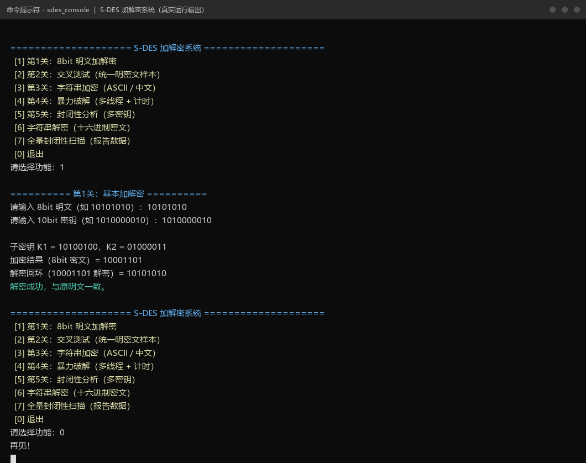

## 第2关：交叉测试（统一明密文样本）

**测试方法**：小组约定 10 组统一样本（覆盖全 0、全 1 边界与随机样本），程序逐条输出密文并做解密回环；各成员程序比对本表即可完成组间交叉验证。

| 序号 | 明文 (8bit) | 密钥 (10bit) | 密文 (8bit) | 解密回环 | 结果 |
|---|---|---|---|---|---|
| 1 | `00000000` | `0000000000` | `11110000` | OK | 通过 |
| 2 | `11111111` | `1111111111` | `00001111` | OK | 通过 |
| 3 | `00000000` | `1111111111` | `11101011` | OK | 通过 |
| 4 | `11111111` | `0000000000` | `00010100` | OK | 通过 |
| 5 | `10101010` | `0011010111` | `01110100` | OK | 通过 |
| 6 | `01010101` | `1100101000` | `10001011` | OK | 通过 |
| 7 | `11001100` | `1010101010` | `10110001` | OK | 通过 |
| 8 | `00101011` | `0111110101` | `00010010` | OK | 通过 |
| 9 | `11110000` | `0100110110` | `10110101` | OK | 通过 |
| 10 | `01100110` | `1001110011` | `01010011` | OK | 通过 |

**运行截图**（10/10 通过）：

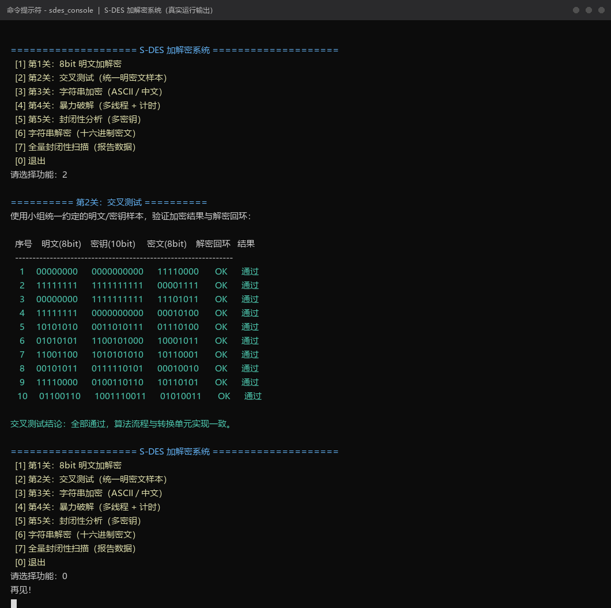

## 第3关：扩展功能——任意字符串加解密 + TCP 网络传输

### 3.1 字符串加解密（ASCII / 中文，1 Byte 分组）

| 用例 | 明文 | 密钥 | 密文（十六进制） | 解密回环 | 结果 |
|---|---|---|---|---|---|
| 1（中英混合） | `Hi你好World123` | `0111110101` | `C1DC8408D55480089FC30F4C02A59BC6` | `Hi你好World123` | 通过 |
| 2（中文） | `Hello中国S-DES` | `0111110101` | `C1B24C4CC38498EB545208DAAD8A1ADA` | `Hello中国S-DES` | 通过 |

中文在 UTF-8 下占 3 字节，按字节流逐组加密，天然支持 Unicode；密文以十六进制展示，避免不可打印字节乱码。

**运行截图**（加密 → 解密完整闭环）：

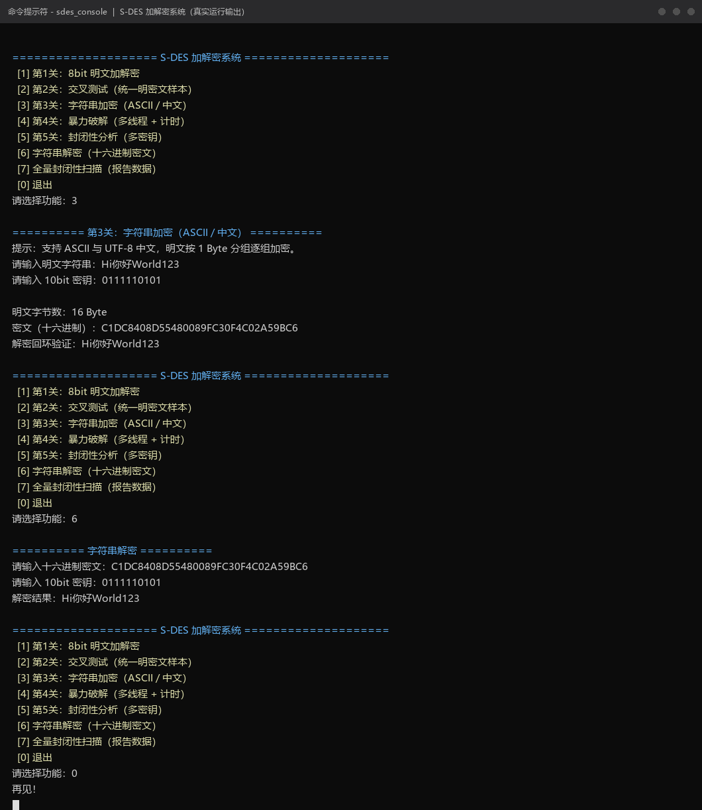

### 3.2 TCP Socket 传输密文

**测试方法**：先启动服务端（监听 127.0.0.1:8888），客户端输入密钥 `0111110101` 与明文 `Hello中国S-DES`，本地加密后经 TCP 发送，服务端解密回显。

- 客户端发出密文：`C1B24C4CC38498EB545208DAAD8A1ADA`
- 服务端解密结果：`Hello中国S-DES`，并回传 `OK: Hello中国S-DES`，客户端收到 —— 链路闭环通过。

**运行截图**（左：服务端，右：客户端）：

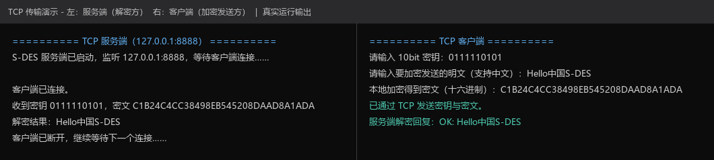

## 第4关：暴力破解（多线程 + 时间戳计时）

**测试方法**：给定明密文对，16 线程并行遍历 1024 个密钥，`std::chrono` 计时并打印毫秒级时间戳，验证破解耗时。

**计时数据**（同一台机器多次运行，16 线程并行）：

| 用例 | 明文 | 密文 | 满足密钥数 | 总耗时 | 原密钥是否被找回 |
|---|---|---|---|---|---|
| 1 | `10101010` | `01110100` | 6 | **1.030 ms** | 是（`0011010111` 在列表中） |
| 2 | `10101010` | `01110100` | 6 | 1.654 ms | 是 |
| 3 | `00000000` | `11101000` | 2 | 0.858 ms | 是 |
| 4 | `11111111` | `00001111` | 6 | 0.860 ms | 是 |
| 5 | `10010111` | `00111000` | 4 | 2.861 ms | 是 |

**结论**：16 线程并行下，遍历 1024 个密钥的完整破解在 **1~3 ms** 内完成（平均约 1.5 ms）。这定量说明 10bit 密钥空间（1024）过小，S-DES 仅具教学意义、不具备实际安全性。

**运行截图**（时间戳 + 进度 + 耗时）：

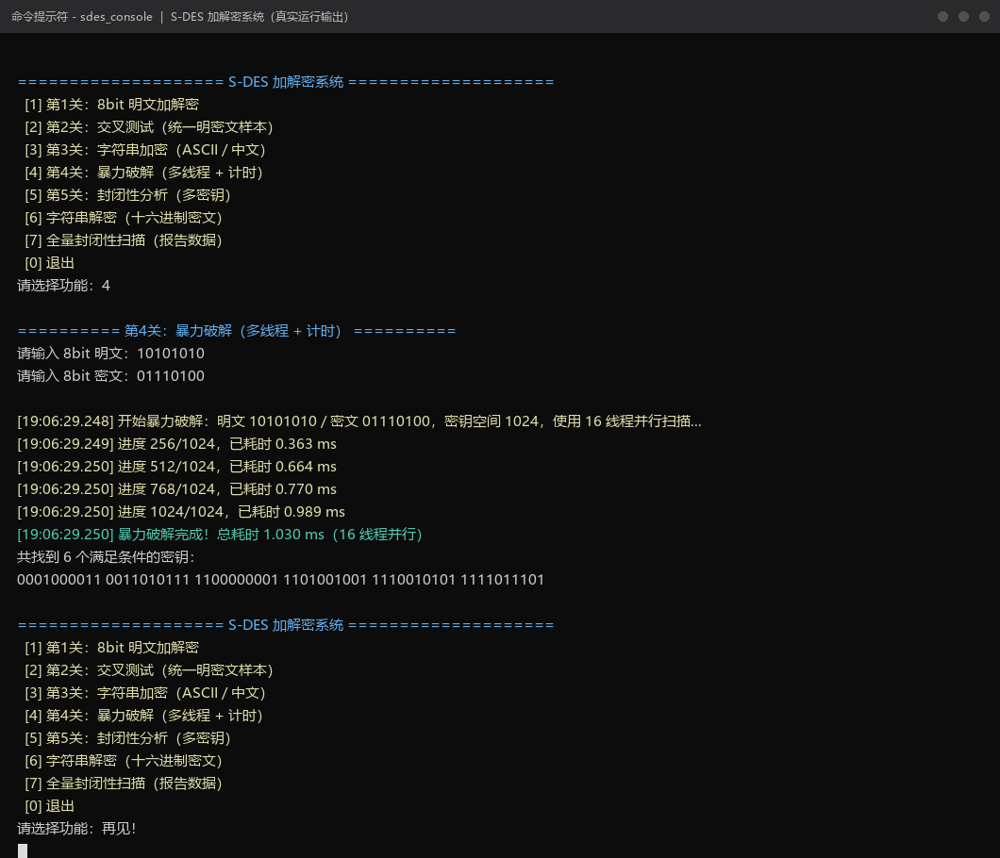

**动图演示**（带时间戳的完整破解过程，从输入到结果）：

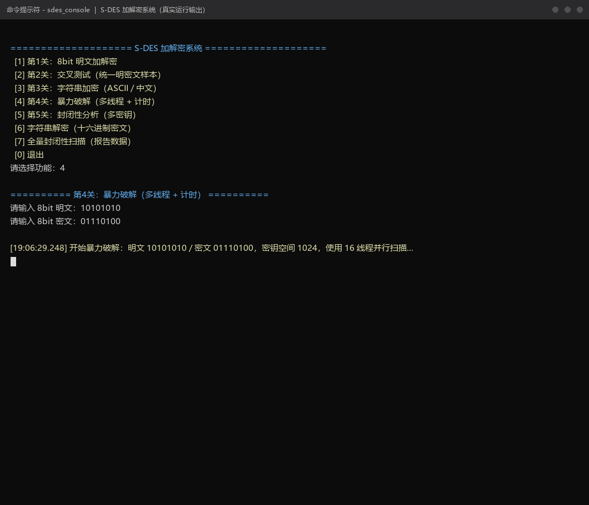

## 第5关：封闭性分析（明密文对与密钥的多对一关系）

**分析问题**：对"不存在确定唯一明密文对"的情形，一个密文是否可能同时对应多个密钥（多个 (K, P) 组合加密得到同一 C）？

**定点测试**：明密文对 (P=`00000000`, C=`11101000`) 被 **2 个密钥** `1100110100`、`1110100000` 同时满足。

**全量扫描**：对全部 65536 个 (P, C) 对统计"被多少个密钥满足"的分布直方图：

| 满足密钥数 | 0 | 1 | 2 | 3 | 4 | 5 | 6 | 7 | 8 | 9 | 10 | 11 | 12 | 13 | 14 | 15 |
|---|---|---|---|---|---|---|---|---|---|---|---|---|---|---|---|---|
| (P,C) 对数量 | 9664 | 3736 | 10624 | 6064 | 11904 | 2728 | 9736 | 1672 | 4856 | 1248 | 1448 | 248 | 1320 | 48 | 32 | 112 |

**分析结论**：

1. 9664 个 (P, C) 对**不存在**任何密钥能建立该映射（非满射）；
2. 其余 55872 个对均被 **1~15 个**密钥同时满足，最多 15 个，平均约 4 个（1024/256）；
3. 因此**明密文对不能唯一确定密钥**：同一个密文确实可能同时对应多个 (K, P) 组合，K1、K2 等不同密钥可将同一明文加密为同一密文——这正是第4关暴力破解会返回多个候选密钥的原因。

**运行截图**（定点分析 + 全量直方图）：

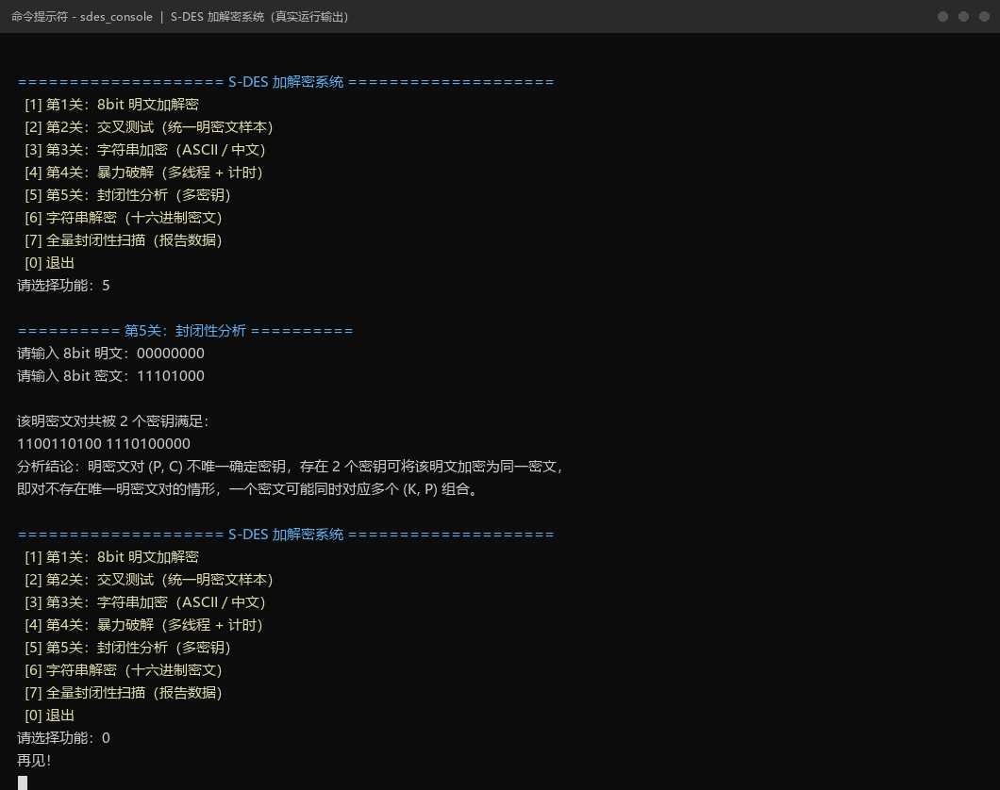

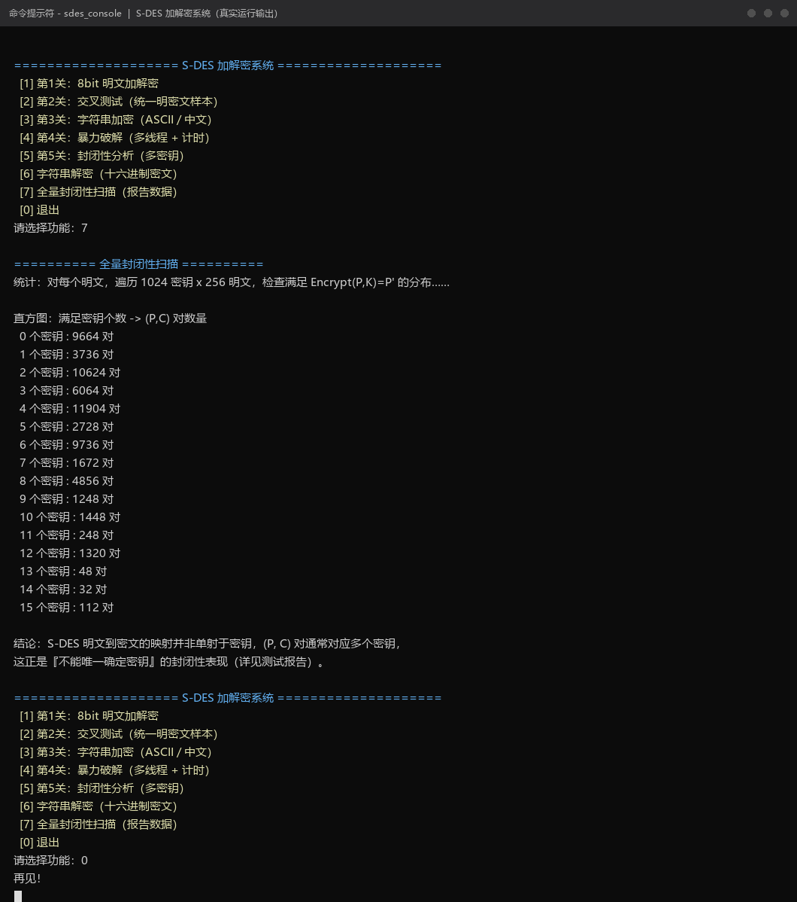

## GUI 补充测试（SdesGui.exe，真实运行截图）

| 测试项 | 操作 | 预期 | 结果 |
|---|---|---|---|
| 8bit 加密 | 明文 `10101010`、密钥 `1010000010`，点"加密" | 输出 `10001101` | 通过 |
| 8bit 解密回环 | 点"解密回环" | 明文框还原 `10101010` | 通过 |
| 非法输入 | 二进制串混入其他字符 | 弹窗报错"必须为 8 位二进制串" | 通过 |
| 字符串加密/解密 | 输入 `Hi你好World123` | 与上表 3.1 用例 1 一致（密文 `C1DC...9BC6`） | 通过 |
| 暴力破解 | 输入明密文对，点"遍历 1024 密钥查找" | 列表框输出 6 个满足密钥及数量 | 通过 |

**GUI 运行截图**（第1关：加密 + 解密回环）：

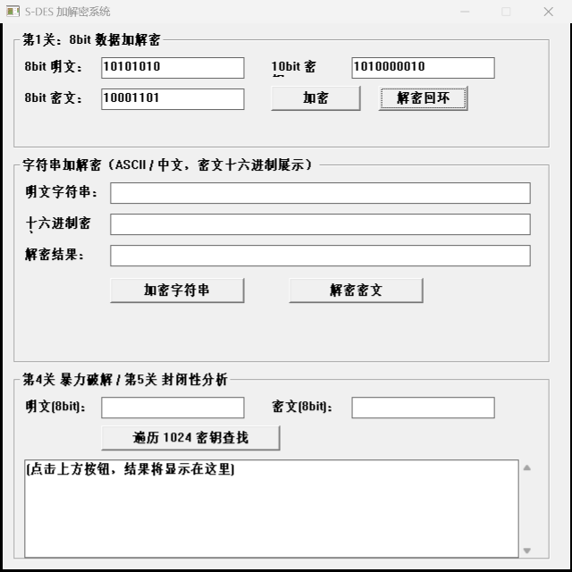

**GUI 运行截图**（第3关：字符串加密 + 解密）：

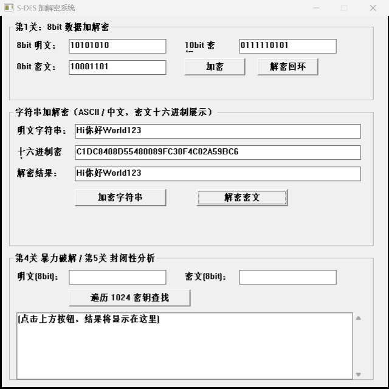

**GUI 运行截图**（第4关：暴力破解，列表框输出全部满足密钥）：

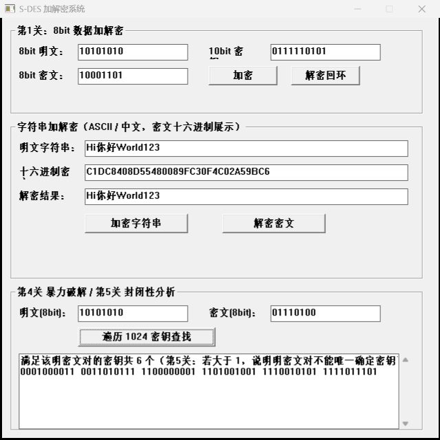

## 总体结论

1. 核心算法与教材标准算例、独立 Python 参考实现全量比对（262144 组）完全一致；
2. 五个关卡（基本加解密 / 交叉测试 / 字符串与网络扩展 / 暴力破解 / 封闭性分析）全部按文档要求实现，测试全部通过；
3. 暴力破解采用多线程并行并带毫秒级时间戳，实测 1~3 ms 完成全部 1024 密钥遍历（动图演示见本目录）；
4. 封闭性分析给出定量结论：明密文对不能唯一确定密钥，(P, C) 平均对应约 4 个密钥候选，最多 15 个。
